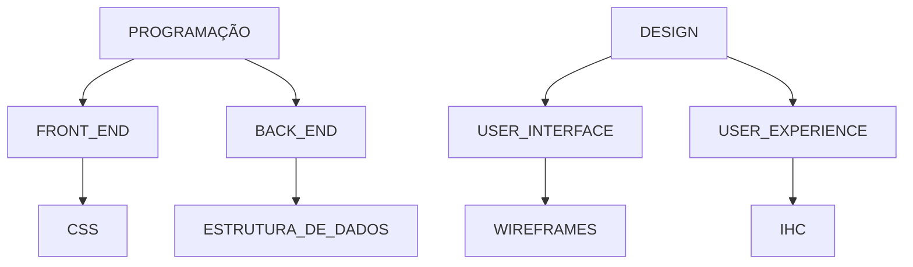

# Objetivo deste repositório é centralizar todo o aprendizado e links de interesse.
Cada pasta deverá ser relacionada a um tema generalistico, e as subpastas devem especializar mais o tema relacionado.

imagem 1: Exemplo de um fluxo correto das pastas e subpastas.

## Referências Utilizadas
[Sintaxe Mermaid em Markdown](https://github.blog/2022-02-14-include-diagrams-markdown-files-mermaid/)

[Online Mermaid Editor](https://mermaid.live/edit#pako:eNp1kE1rwzAMhv9K0bk0S7Klbc4bO5dec1FsOTaLP3DkQgn573PoCGMfOknP--oDzSC8JGhhMPweMejO7XIIb63h33kf0Qm9k3Sj0YcvXZP48Il_0H8mbG6Lxj2QpTjQX92X7wXsIRtzl8zXzqvSAWuy1EGbU0kK08gddG7JVkzsr3cnoOWYaA8pSGR6NThEtNAqHKeNvknDPm5w9CgplzPwPTxeM63bhXfKDCtPccxYM4epLYpVPuT36dQf8qnFZKTGyPp2boqmak5Y1dQca3ypayn68nxS1XOp5PGprBCWZfkEs0mAVw)

---
Ultima atualização 11/05

 
 
 
